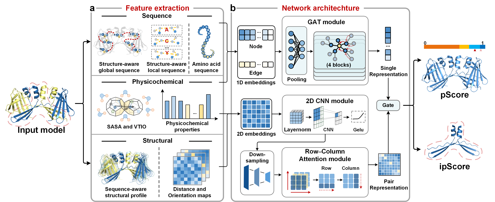

# DeepUMQA-Global
DeepUMQA-Global is a deep learning framework for estimating the fold accuracy of protein structural models at both the global complex (pScore) and interface (ipScore) levels. We introduce a structure–sequence cross-consistency mechanism that captures the bidirectional compatibility between the three-dimensional structure and the amino acid sequence.

## ⭐**Overall workflow for the DeepUMQA-Global**⭐


---

## 🚀 **Getting Started**

### **🔧 Software Requirements**

To run this project, you need the following dependencies installed **(or use the provided Singularity container)**:

- Python ≥ 3.8  
- PyTorch 1.11.0  
- PyTorch Geometric 2.0.4
- biopython==1.78
- numpy==1.18.5
- pandas==1.3.5
- scipy==1.7.3
- PyRosetta ≥ 2021.38+release.4d5a969
- **Voronota** ([GitHub](https://github.com/kliment-olechnovic/voronota?tab=MIT-1-ov-file)) | [MIT](https://opensource.org/license/mit)
  - Installed in a conda environment named `vorolf` 
- **Foldseek** ([GitHub](https://github.com/steineggerlab/foldseek)) | [GPL-3.0](https://opensource.org/licenses/GPL-3.0)  
  - Installed in a conda environment named `foldseek-multimer`  
- **ProteinMPNN** ([GitHub](https://github.com/dauparas/ProteinMPNN)) | [MIT](https://opensource.org/license/mit)  
  - Installed in a conda environment named `MPNN`
 
**Download [Singularity container](https://zenodo.org/api/records/19888061/draft/files/DeepUMQAGlobal.sif/content) (container size: 6.64 GB).**
 
### **📥 Data Preparation (Required)**

- **PDB100**([PDB100](https://steineggerlab.s3.amazonaws.com/foldseek/pdb100.tar.gz))
  - Template database for SAGS feature extraction (complex)
- **PDB_AFDB_207187**([PDB_AFDB_207187](http://zhanglab-bioinf.com/PAthreader/database/PDB_AFDB_207187.tar))
  - Template database for SAGS feature extraction (monomer)
- **PDB_AFDB_db** (Foldseek-formatted database converted from PDB_AFDB_207187)  
  Build the Foldseek database using:
  ```bash
  foldseek createdb PDB_AFDB_207187 PDB_AFDB_db

---

## 🏃 Running the Pipeline
### 🛠**Download DeepUMQA-Global package**

```
git clone --recursive https://github.com/iobio-zjut/DeepUMQA-Global 
```

### ⚡ Quick Start

Run directly:

```bash
bash bin/run_pipeline.sh
```

This script uses the following defaults:

* `./example/pdb`
* `./example/query`
* `./example/feature`  # have extracted
* `./example/output`
* `./checkpoints`


### 📌 Command-Line Usage
---
The main pipeline runs inside a Singularity container.  
All required binaries and environments are pre-installed in the container.

####  Required Input (IMPORTANT)

The pipeline fundamentally operates on four input directories defined per case:

```bash
CASE_DIR=/path/to/case

PDB_ROOT="${CASE_DIR}/pdb"
QUERY_ROOT="${CASE_DIR}/query"
FEATURE_ROOT="${CASE_DIR}/feature"
OUTPUT_ROOT="${CASE_DIR}/output"
```

#### 📂 Meaning of Inputs

| Variable       | Description                                                      |
| -------------- | ---------------------------------------------------------------- |
| `PDB_ROOT`     | Input protein structure files (PDB/mmCIF)                        |
| `QUERY_ROOT`   | Query target list or metadata for evaluation                     |
| `FEATURE_ROOT` | Precomputed structural/sequence features (required for speed-up) |
| `OUTPUT_ROOT`  | Output directory for predicted scores and intermediate results   |

> ⚠️ These four paths define a **single evaluation case** and are the ONLY required user-facing inputs for inference.

---

#### 📌 Advanced Command-Line Configuration

The pipeline runs inside a Singularity container. Internal binaries and databases are pre-configured.

#### 🧱 Environment Variables (Container Runtime)

| Variable                    | Description                                                            |
| --------------------------- | ---------------------------------------------------------------------- |
| `SCRIPT_DIR`                | Location of pipeline scripts                                           |
| `LOCAL_PROJECT_DIR`         | Project directory on host machine (**must be mounted into container**) |
| `CONTAINER_PROJECT_MOUNT`   | Mount point inside container (default: `/repo`)                        |
| `PYTHON_BIN_IN_CONTAINER`   | Python interpreter inside container                                    |
| `FOLDSEEK_BIN_IN_CONTAINER` | Foldseek binary (multimer version)                                     |
| `VORO_EXE_DIR_IN_CONTAINER` | Voronota executable directory                                          |

---

#### 🧠 External Database Paths

| Variable                         | Description                                  |
| -------------------------------- | -------------------------------------------- |
| `DEFAULT_SP_TEMPLATE_DB`         | PDB100 Foldseek database (complex templates) |
| `DEFAULT_SP_MONOMER_TEMPLATE_DB` | PDB_AFDB_207187 monomer template database    |
| `DEFAULT_AFDB_DIR`               | AlphaFold DB structure repository            |

---

#### ⚠️ Notes

* `LOCAL_PROJECT_DIR` must be correctly mounted into the container.
* Only modify internal paths when deploying to a new cluster environment.
* The pipeline is fully compatible with Singularity-based execution.

---

#### 📁 Project Structure

```text
DeepUMQA-Global/
├── run_dual_inference.py
├── bin/
│   ├── run_pipeline.sh
│   └── run_quickstart.sh
├── checkpoints/
│   └── best.ckpt
├── structure_rank/
├── example/
│   ├── pdb/
│   ├── query/
│   ├── feature/
│   └── output/
```

---

### ⚡ Summary

* User-level required inputs: **PDB_ROOT / QUERY_ROOT / FEATURE_ROOT / OUTPUT_ROOT**
* Everything else: **container + database configuration (advanced)**
* Default mode: `bash bin/run_pipeline.sh`

---

## 📚 Resources

[CASP16 EMA Data](https://predictioncenter.org/download_area/CASP16/)
Includes predicted models, experimental structures, and EMA results.

[PDB-2024 Targets](https://www.rcsb.org/): Estimation for docking-based models.

[CoDNaS](http://ufq.unq.edu.ar/codnas/): Estimation for alternative conformational states proteins.

---

## 📬 Contact (Supervisor)

**Prof. Guijun Zhang**  
College of Information Engineering  
Zhejiang University of Technology, Hangzhou 310023, China  
✉️ Email: [zgj@zjut.edu.cn](mailto:zgj@zjut.edu.cn)
